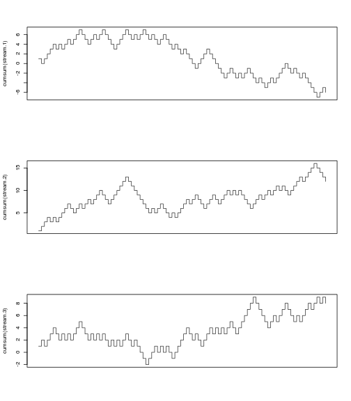
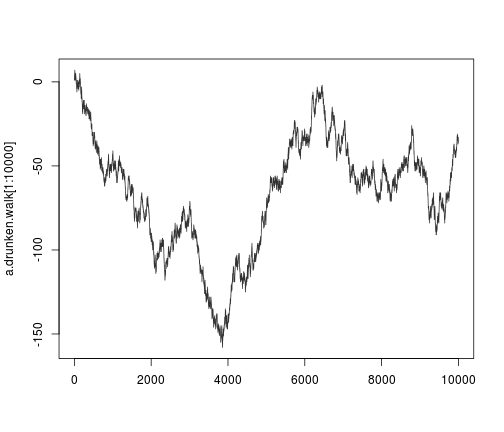
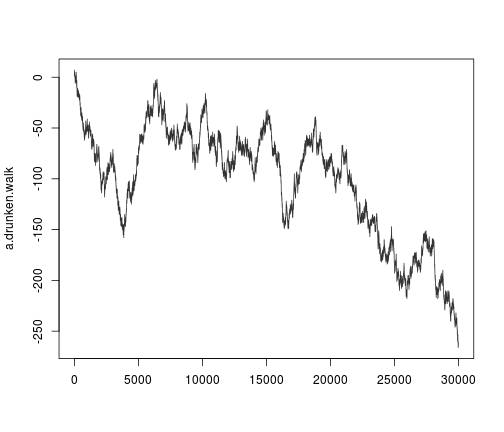
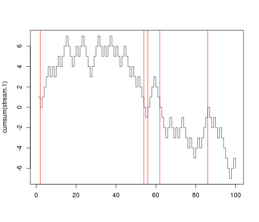
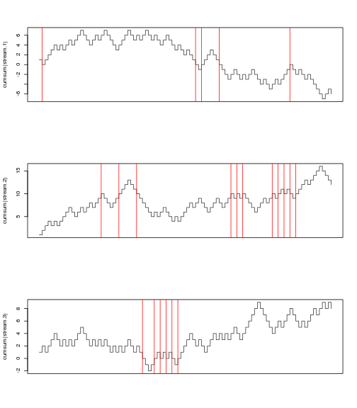

Flipping Coins in Honour of Pólya György
========================================================

I don't remember how I first started thinking about probability and randomness---whether I was thinking about free will, or an episode of _Step By Step_ where the nerd kid tries to do something _truly_ unpredictable, or Dungeons & Dragons. (Which was also the beginning of my interest/obsession with mathematical modelling of human factors.)

Those of us lucky enough to own or have access to electronic calculating machines that do 2 billion clicks a second don't need to roll dice or flip coins anymore. With 

In addition to rolling up [wieners](http://isomorphismes.tumblr.com/post/9923467729/wiener-processes) of different spices and cultures with a few keystrokes, we can also flip coins or roll dice. Which is the reason `Baldur's Gate II` is so much more fun than sitting around and rolling dice during a tabletop battle--so much less waiting when a billion-clicky calculator does all of the computations for you.

Flipping 100 fair coins is as easy as `sample( c(-1,+1), 100, replace=TRUE)`. For a million coins, `sample( c(-1,1)), 1e6, replace=TRUE)`.


```r
# for reproducibility
pythagoras <- sqrt(2)
set.seed(pythagoras)
# flip a coin
coin <- c(-1, +1)
sample(coin, 100, replace = TRUE)
```

```
##   [1] -1 -1  1  1 -1  1  1  1  1 -1 -1 -1  1 -1  1 -1  1  1 -1  1  1 -1  1
##  [24] -1 -1 -1 -1 -1  1 -1 -1  1 -1 -1  1  1  1 -1  1 -1  1  1  1  1  1  1
##  [47] -1 -1  1  1 -1  1 -1 -1 -1 -1 -1  1  1 -1  1 -1 -1 -1  1 -1 -1  1 -1
##  [70]  1 -1  1 -1 -1 -1  1  1 -1  1  1 -1  1 -1 -1  1 -1  1 -1 -1 -1 -1 -1
##  [93]  1  1  1  1 -1 -1  1  1
```


Nice. My [`lappy2000`](http://www.homestarrunner.com/sbemail) probably flipped them faster than it loads TheFacebook.com.

I used `-1` and `+1` rather than `heads` and `tails` because Pólya's fascinating finding is to do with re-interpreting `{H,T}` as steps to the left or right on a [1-D](http://isomorphismes.tumblr.com/tagged/1-D) number line. Colourfully known as "the drunkard's walk" or just a "random walk", the question is about [integrals](http://isomorphismes.tumblr.com/tagged/integral) of coin flips---in the language of `#Rstats`, cumulative sums `cumsum`. Say every head made you step left and every tail made you step right---well we know that "on expectation" you stay in the centre, but what about all of the interesting sequences that could happen? The &int; refocusses our attention on the [sequences](http://isomorphismes.tumblr.com/tagged/sequences) or [paths](http://isomorphismes.tumblr.com/tagged/path) rather than the final result.


```r
stream.1 <- sample(coin, 100, replace = TRUE)
stream.2 <- sample(coin, 100, replace = TRUE)
stream.3 <- sample(coin, 100, replace = TRUE)
```


To see my point, let's 


```r
stream.1 <- sample(coin, 100, replace = TRUE)
stream.2 <- sample(coin, 100, replace = TRUE)
stream.3 <- sample(coin, 100, replace = TRUE)
cumsum(stream.1)
```

```
##   [1]  1  0  1  2  3  4  3  4  3  4  5  4  5  6  7  6  5  4  5  6  5  6  7
##  [24]  6  5  4  3  4  5  6  7  6  5  6  5  6  7  6  5  6  5  4  5  6  5  4
##  [47]  3  4  3  2  3  2  1  0 -1  0  1  2  3  2  1  0 -1 -2 -3 -2 -1 -2 -3
##  [70] -2 -3 -2 -1 -2 -3 -4 -3 -4 -5 -4 -3 -4 -3 -2 -1  0 -1 -2 -1 -2 -3 -2
##  [93] -3 -4 -5 -6 -7 -6 -5 -6
```

```r
# plot them in a 3×1 'matrix'
par(mfrow = c(3, 1))
# we don't need no steenkeeng x-axis!
par(xaxt = "n")
plot(cumsum(stream.1), type = "s", col = "#333333", xlab = "")
plot(cumsum(stream.2), type = "s", col = "#333333", xlab = "")
plot(cumsum(stream.3), type = "s", col = "#333333", xlab = "")
```

 


Fun! Remember that even though the pictures look "up" and "down" that's just one of those &fnof;(x)-versus-x things, we _did_ say left & right originally (so turn your head like reading a `(:` and let &uarr; be "time forward").

And one really long one, just to verify the intuition of regression to the mean: the Tom Stoppard lucky streak just isn't going to go on forever, _eventually_ the drunken linelander will have to hang around the starting point.


```r
a.drunken.walk <- cumsum(sample(coin, 30000, replace = TRUE))
plot(a.drunken.walk[1:10000], type = "s", col = "#333333", xlab = "")
```

 

```r
plot(a.drunken.walk, type = "s", col = "#333333", xlab = "")
```

 


Wow, that compiled fast! And look, my idea about how it needs to tend to zero is not so correct. The "stock" made new lows around 4000 and looked like it was returning to "home" (remind you of the `EUR:USD` predicted return to parity?). But it turns out that it would make new lows again around 16,000 and then at the end of our period it's diving even deeper than we've ever seen before! Predicting random noise isn't as easy as it looks.

You could ask a lot of interesting questions about this time series, like just watch the maxes or mins evolve over time, or track the 70% quantile, or apply smoothers to it. All relatively easy with some research into the right commands in `R`. This is why we spend our weekends indoors, folks. Fun on the command line.


```

```

Crossing points. See `algebraic variety`! 


```r
plot(cumsum(stream.1), col = "#333333", type = "s", xlab = "")
# crossing points. google 'algebraic variety'! or varietal, if you prefer.
zeros.1 <- grep(0, cumsum(stream.1))
zeros.1
```

```
## [1]  2 54 56 62 86
```

```r
abline(v = zeros.1, col = "red")
```

 


Let's see that in all three of the old ones.


```r
zeros.2 <- grep(0, cumsum(stream.2))
zeros.3 <- grep(0, cumsum(stream.3))
# plot them in a 3×1 'matrix'
par(mfrow = c(3, 1))
# we don't need no steenkeeng x-axis!
par(xaxt = "n")
plot(cumsum(stream.1), type = "s", col = "#333333", xlab = "")
abline(v = zeros.1, col = "red")
plot(cumsum(stream.2), type = "s", col = "#333333", xlab = "")
abline(v = zeros.2, col = "red")
plot(cumsum(stream.3), type = "s", col = "#333333", xlab = "")
abline(v = zeros.3, col = "red")
```

 


And that's a way to look at what Pólya discovered. OK, he didn't exactly do this because his random walks _first_ select a direction (in 1-, 2-, 3-, or 4-D) and _then_ 


```
 
```

I divide probability musings into two categories: philosophical (foundations, entropy, information, what is probability?, subjective probability) and technical (martingales, measure spaces, stochastic processes, time series, information theory).

You might legitimately raise the following objection: These aren't _real_ random numbers, they're *pseudo* random! That's true, but not a valid objection, because:
1. Who says the stochastic processes we encounter in life are _truly_ random either? They reflect some kind of epistemic uncertainty ("God knows how the dice will land" &ndash; and so would a human with perfect measurements and enough computational power) meaning we don't know exactly how they will turn out. We're also epistemically unsure about the pseudorandom numbers.
2. Pseudorandom numbers are _validated for_ the kinds of concerns that would invalidate the generator, like heads/tails fairness,lack sequential patterns in a sequence of 100, and likestuff.
  * Actually you can google "Diehard battery of statistical tests" and `R`'s `?set.seed` will describe to you which methods of pseudorandom generation passed them.

```

```
OK that is the basics of random walks. But what Pólya discovered that's so fascinating has to do with more dimensions. Obviously on the Earth we don't walk in one line, we creepeth and crawleth on a 2-D surface of a 3-D ball. Drunkards walk on like a chess board, and even though they are usually directed-random (Wiener with &mu; &e; 0)---we can still "subtract off" the directed part and treat the random walk as just a "component" of a . (Especially easy to do with a 1-D random walk: just imagine these left-right staggers are the drunk going orthogonally off the )


And &exist; lots of other kinds of random walks too:
* randomise the step time
* different randomness for the step sizes ($|\text{Cauchy}|$, Poisson, whatever)


But for starters and for exposition, simpler is better. You can go wild with your own command-line freakshow. I won't peep and I won't even judge if you 


```

```

&exist; a story about Pólya György which will not surprise you in the least if you know the masochistic, arrogant, pro-left-brain, fear-of-saying-something-wrong culture of university mathematics:

> A lowly graduate student grovelled before the elder Pólya: "P-P-Professor, if you would what's the intuition behind why the random walk returns with certainty in 2 dimensions but with only 1/3 probability in 3 dimensions?"
> The elder professor retorted, with a smile: "The intuition is that the one space is bigger than the other."
